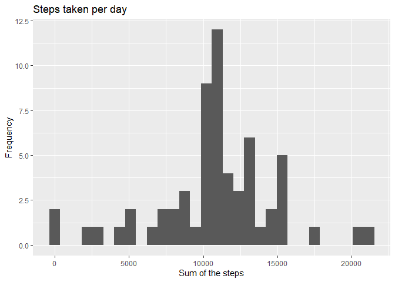

This assignment makes use of data from a personal activity monitoring device. This device collects data at 5 minute intervals through out the day. The data consists of two months of data from an anonymous individual collected during the months of October and November, 2012 and include the number of steps taken in 5 minute intervals each day.

The data for this assignment can be downloaded from the course web site:

* Dataset: [Activity monitoring data](https://d396qusza40orc.cloudfront.net/repdata%2Fdata%2Factivity.zip)

## Loading and preprocessing the data

Unzip the data, read the data from csv file. And process the data to sum up the steps


```r
unzip("./activity.zip")
activity<-read.csv("./activity.csv")
```


## What is mean total number of steps taken per day?

Graph the histogram of total number of steps taken per day


```r
library(ggplot2)
with(activity,qplot(sapply(split(steps,date),sum),bins=30, main = "Steps taken per day", xlab="Sum of the steps",ylab="Frequency"))
```

```
## Warning: Removed 8 rows containing non-finite values (stat_bin).
```

<!-- -->

### Calculated the mean and median of the total number of steps taken per day

Mean of the total number of steps per day:


```r
mean(sapply(split(activity$steps, activity$date), sum), na.rm = TRUE)
```

```
## [1] 10766.19
```

Median of the total number of steps per day:

```r
median(sapply(split(activity$steps, activity$date), sum), na.rm = TRUE)
```

```
## [1] 10765
```

## What is the average daily activity pattern?
Time series plot of the 5-minute interval (x-axis) and the average number of steps taken, averaged across all day (y-axis)


```r
interval <- activity[activity$date =="2012-10-01",3]
MEAN<- tapply(activity$steps, activity$interval, mean,na.rm=TRUE)
plot(interval, MEAN,type="l",ylab="mean number of steps")
title("Time Series of Mean steps")
```

<!-- -->

### which 5-minute interval, on average across all the days in the dataset, contains the maximum number of steps?


```r
MAX<-names(MEAN)[which(MEAN==max(MEAN))[[1]]]
MAX
```

```
## [1] "835"
```
For the input we can see, that 8:35 time interval has the maximum number of steps.

## Imputing missing values

Creating a new activity date, where NA is filled with interval mean.

```r
activityNoNA<-activity
for(index in 1:nrow(activity)){
    if(is.na(activityNoNA[index,1])){
      activityNoNA[index,1]<-MEAN[[which(interval == activityNoNA[index,3])]]
    }
}
```

### Making a new histogram


```r
library(ggplot2)
with(activityNoNA,qplot(sapply(split(steps,date),sum),bins=30, main = "Steps taken per day", xlab="Sum of the steps",ylab="Frequency"))
```

<!-- -->

### Mean of the total number of predicted steps per day:

```r
mean(sapply(split(activityNoNA$steps, activityNoNA$date), sum), na.rm = TRUE)
```

```
## [1] 10766.19
```

### Median of the total number of predicted steps per day 


```r
median(sapply(split(activityNoNA$steps, activityNoNA$date), sum),na.rm = TRUE)
```

```
## [1] 10766.19
```

Mean doesn't change, because mean function is used to fill NA, median became equal to mean.

## Are there differences in activity patterns between weekdays and weekends?

Firstly, let's build graphics devided by type of the day:


```r
activity$day <- ifelse(as.POSIXlt(as.Date(activity$date))$wday%%6 == 0, "weekend", "weekday")
activity$day <- factor(activity$day, levels = c("weekday", "weekend"))
stepsintervalnoNA <- aggregate(steps ~ interval + day, data = activity, mean)
library(lattice)
xyplot(steps ~ interval | factor(day), data = stepsintervalnoNA, aspect = 1/2, type = "l", xlab = "5-minute interval", ylab = "Average number of steps taken", main = "Average number of steps taken across all days")
```

<!-- -->
