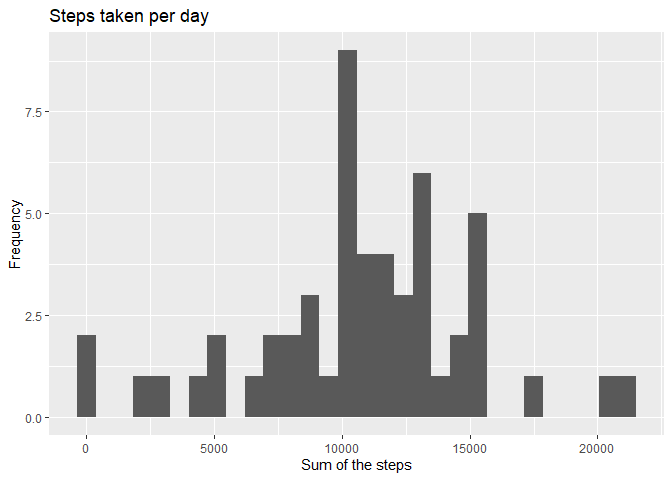

## Loading and preprocessing the data

```r
activity<-read.csv("./activity.csv")
SUM<-tapply(activity$steps,activity$date,sum,na.rm=TRUE)
date<-unique(activity$date)
```


## What is mean total number of steps taken per day?

```r
hist(SUM)
```

<!-- -->

```r
mean(SUM)
```

```
## [1] 9354.23
```

```r
median(SUM)
```

```
## [1] 10395
```


## What is the average daily activity pattern?

```r
interval <- activity[activity$date =="2012-10-01",3]
MEAN<- tapply(activity$steps, activity$interval, mean,na.rm=TRUE)
plot(interval, MEAN,type="l",ylab="mean number of steps")
title("Time Series of Mean steps")
```

<!-- -->


## Imputing missing values

```r
for(index in 1:nrow(activity)){
    if(is.na(activity[index,1])){
      activity[index,1]<-MEAN[[which(interval == activity[index,3])]]
    }
}
```


## Are there differences in activity patterns between weekdays and weekends?

```r
activity$weekdays<-weekdays(strptime(activity[,2],format ="%Y-%m-%d"))
Weekend<-activity[grepl("S(at|un)", activity$weekdays),]
Weekdays<-activity[!grepl("S(at|un)", activity$weekdays),]
MEAN_Weekend<- tapply(Weekend$steps, Weekend$interval, mean,na.rm=TRUE)
MEAN_Weekdays<- tapply(Weekdays$steps, Weekdays$interval, mean,na.rm=TRUE)
par(mfrow=c(2,1))
plot(interval, MEAN_Weekdays,type="l",ylab="mean steps during Weekdays")
title("Time Series of Mean steps during Weekdays")
plot(interval, MEAN_Weekend,type="l",ylab="mean steps during Weekend")
title("Time Series of Mean steps during Weekend")
```

<!-- -->
